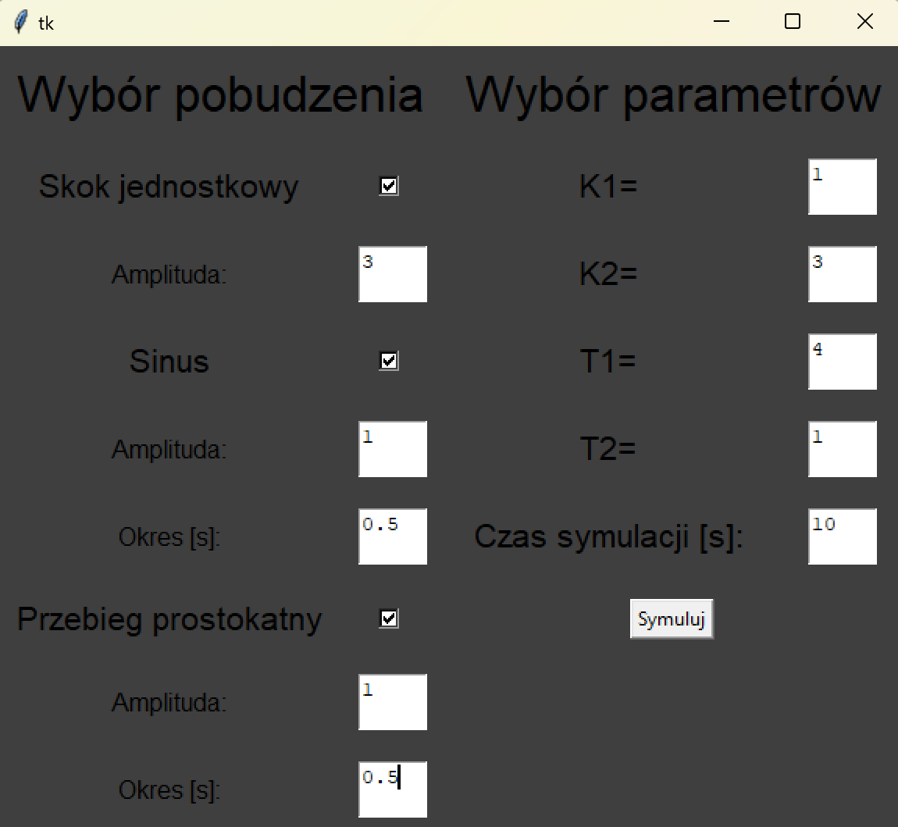
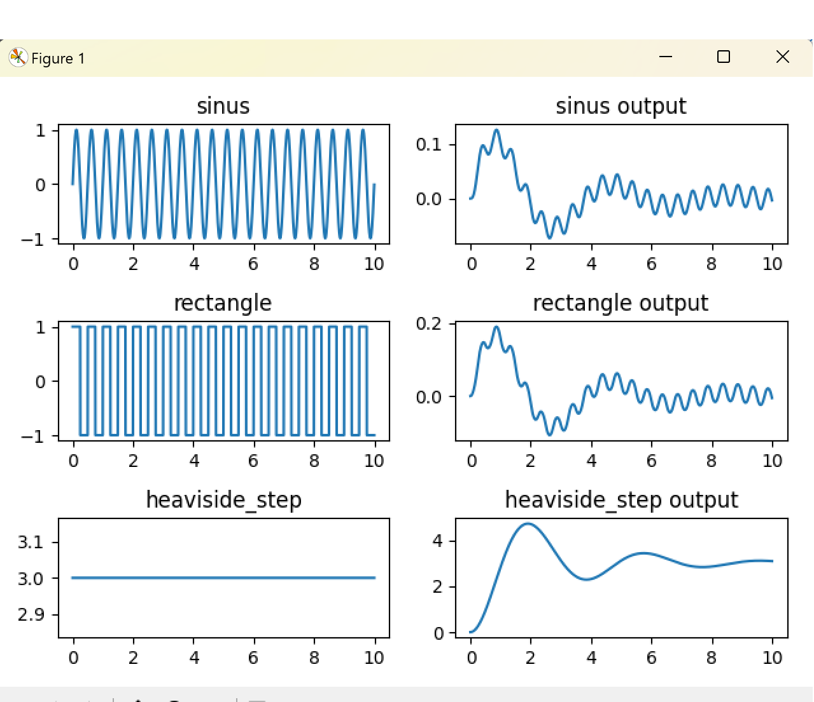

# Continous system symulation

This project aims to simulate a closed-loop control system featuring a DC motor and a PI (Proportional-Integral) controller. The system allows for the definition of various parameters and input signals, providing insights into the behavior and stability of the controlled system. The program was written in Python using numpy for calculation purposes and tkinter for visualization.

## Features
- **Parameter Definition:** Define positive parameters `k1`, `k2`, `T1`, and `T2`.
- **Input-Output Display:** Display current input `u(t)` and output `y(t)` values.
- **Input Excitations:** Implement different input excitations such as unit step, sinusoid, and square wave.

## Stability Analysis
Stability analysis is conducted using the Routh array. The stability condition for the closed-loop system is:

`k2` > `T1` + `T2`

## Numerical Integration
Numerical integration is performed using Euler's method (rectangles) to simulate system dynamics.

## Dependencies
- NumPy: For matrix computations.
- - Matplotlib: For plotting graphs.

## Usage
1. Define parameters `k1`, `k2`, `T1`, and `T2`.
2. Choose an input excitation type (unit step, sinusoid, square wave) and parameters.
3. Run the program to observe system behavior and stability.

## Conclusion
- The system demonstrates proper tracking of step and ramp inputs due to two poles at zero in the open-loop transfer function.
- The use of a PI controller ensures relatively easy regulation and calibration of the system.
- Careful parameter selection is crucial for achieving fast and stable system responses.

 

## Note
- Make sure to satisfy the stability condition (`k2 > T1 + T2`) before proceeding with simulations.
